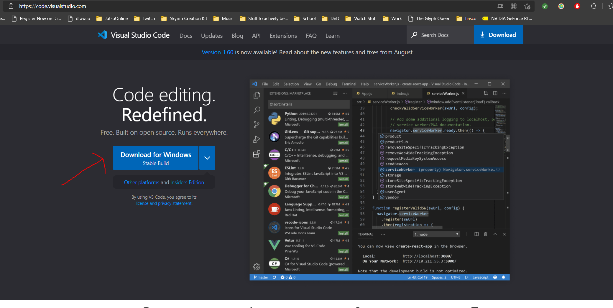
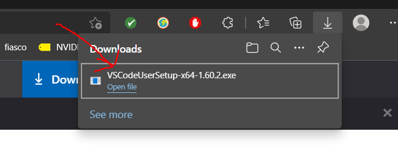
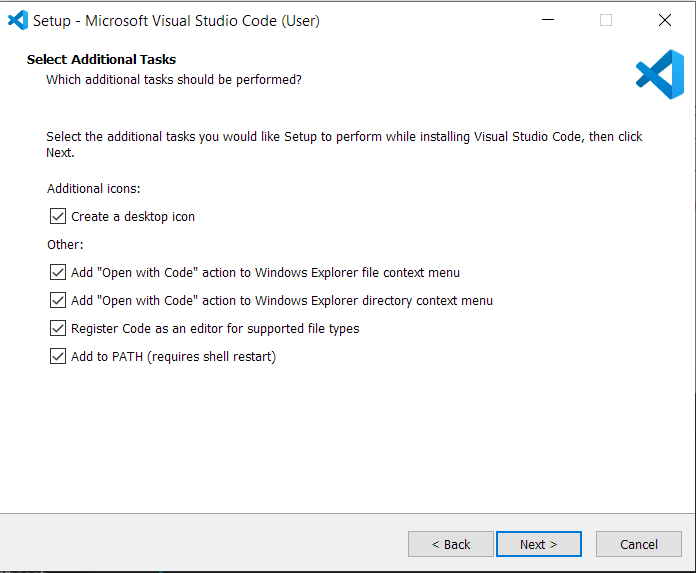
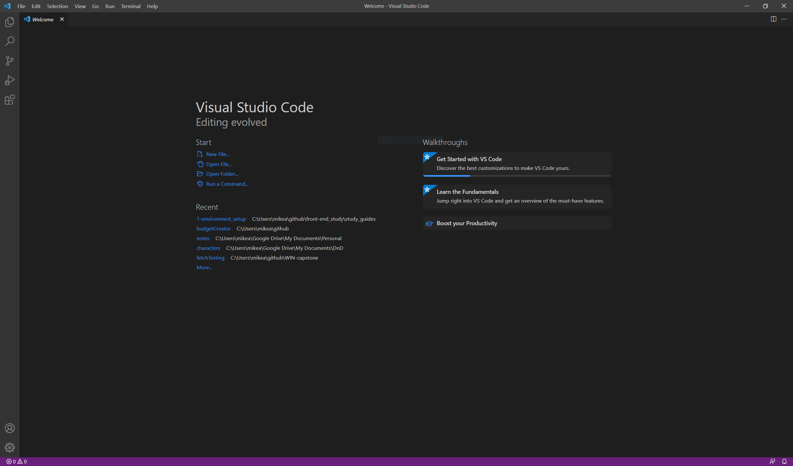

# VSCODE - YOUR NEW WORKSPACE

**vscode**, or visual studio code, is a text editor with downloadable extensions (like your web browser has) that enhances its functionality. In this way it is a pseudo **IDE**,
or **Integrated Development Environment**. IDEs are used by developers not only for text editing purposes, but also to run, test, and debug their code.

Since we will be focusing on front end applications for the time being, which don't require a server to run (for the most part), we only really need vscode, a web browser, and a few extensions to start our journey. This is the first step in that journey.

To begin, let's download and install vscode. 

## 1) Download vscode

To begin, open your web browser (if you're reading this in a text editor) and go to **[https://code.visualstudio.com/](https://code.visualstudio.com/)**

1. On the main page click the link to download the stable build (there are options more mac and linux downloads if you use those, but this guide will follow windows installation)

2. Once the download has completed, go ahead and open and run the file  

3. Accept the user agreement and click next. Then click all the check boxes in the next screen  

4. Click next and then install. Once you are done installing run the program by double clicking the shortcut created on your desktop  

## Congrats! you've just taken your first step into a larger world

